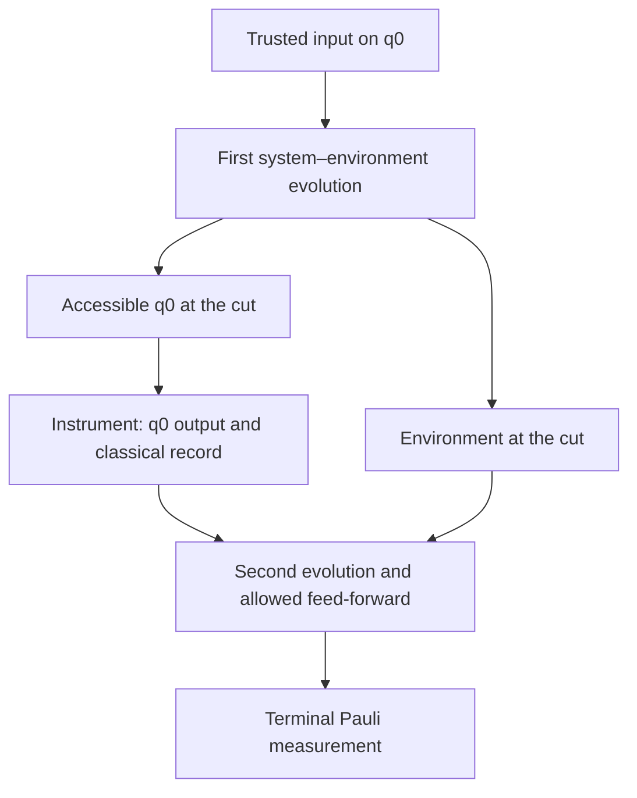

# Measured acquisition semantics and source matching

**2026-09-27 follow-up to PR #18: empirical gate remains open.** This revision
reconstructs measured readout calibration and terminal QPT, resolves their
record-level relationship, and narrows the missing acquisition. It does not
construct a joint environmental-memory confidence region, exclude the
classical null, or fit two different memory explanations to complete empirical
records. The fallback deliverable is the [exact acquisition specification](missing-acquisition.md).

## Frozen empirical target and cut

The concrete candidate is q0 in `quantum_memory_data`, experiment family
`non_Markovian_152ns`, 2026-02-21. The proposed accessible system is q0's
computational qubit; all other physical degrees of freedom are outside that
system. Identifying that ideal qubit with the hardware requires leakage and
SPAM controls. q2's separate readout calibration does not by itself verify
its role or exhaust the environment. Existing records characterize terminal
storage; **a new intermediate intervention is required** for the proposed test.

The [register-aware null](flagged-instrument.md) permits an arbitrary classical
environment register and all declared classical instrument outputs. The
initial input label must not reach the environment or later controller except
through the supplied state. Calibration must isolate the **same** instrument
and bound any change on transfer to the dynamics context. Neither the diagram
nor that isolation is established merely by a stored `reset_type: active`.

## NMN: documented protocol versus inferred file transformation

Pinned archive: `Christina-Giar/NMN-tomo` at
`154235f8bbf5e70eb71c325370a67b1894490452`;
[file hashes](sources.json). Primary protocol: [paper, Section 3 and Figure 2](https://arxiv.org/html/2308.00750v3).
We also inspected all 13 commits reachable from that revision: historical
filenames are notebooks, two count JSONs, fitted matrices, README and license.
The earliest tomography notebook and current `All codes.ipynb` are analysis
code; no original circuit job or implemented regrouping was verified. The
linked generic SQDToolz software is not an acquisition-specific pulse record.

| Stage | Public evidence | What remains unresolved |
|---|---|---|
| Initial preparation | Paper: long-wait initialization, then basis preparation; notebook `Ks` maps xp/xm/yp/ym/zp/zm to 0…5 | Actual pulse/compiled-circuit identifier and per-shot initialization |
| First measurement | Paper: axis rotation, readout classified as 0/1, result stored | Physical classifier settings and job classical-bit slots |
| Re-preparation | Paper: fixed rotation after measurement, outcome selects one of two opposite eigenstates; **no live feed-forward is required** | Exact rotation/label convention in deposited jobs and implemented post-processing permutation |
| Final measurement | Paper: second chosen Pauli observable | Circuit-specific axis rotation and classifier |
| Analysis bit order | `All codes.ipynb`, function `exp2probs`: `counts[l1+l2]`, first character attached to first measurement, second to final measurement | Mapping from native hardware/Qiskit bit string to this analysis string |
| Aggregation | Notebook divides each archived row by that row's total | Shot batches, dropped trials, job totals, drift/interleaving, historical regrouping |

Thus “conditional re-preparation” means outcome-dependent **physical output
and retrospective labeling**, not demonstrated real-time feed-forward. The
paper explicitly notes that system–environment interaction during tomography
operations is outside its reconstructed time resolution. We cannot infer an
intervention–environment coupling bound from that description.

Trace the IBM `21.333,21.333` pair (cell order 00,01,10,11):

| Record | xp,x,xp,x | xp,x,xm,x |
|---|---|---|
| Deposited counts | 7917, 13, 31, 29 | 110, 7830, 5, 65 |
| Inferred physical fixed-rotation circuit | 7917, 13, 5, 65 | 110, 7830, 31, 29 |
| Physical-row total under that inference | 8000 | 8000 |

For the inferred first circuit: prepare X+, first measure X, apply the fixed
rotation whose first-outcome-0 branch prepares X+, and finally measure X.
The first-outcome-1 cells come from the opposite archived output label. This
traces every cell **conditional on** the proposed archive transformation;
it does not recover a missing physical job. The notebook instead normalizes
the original 7990-count row. We retain both interpretations explicitly.

`acquisition_audit.py` enumerates five permutations for all ten runs:

| Candidate semantics | Evidence and disposition |
|---|---|
| Literal rows are physical independent circuits | This is compatible with the notebook's normalization, but totals vary and the paper describes output-dependent relabeling. Not independently ruled out by original job metadata. No inferred-circuit Hoeffding bound is asserted for this alternative. |
| Swap opposite re-preparation labels for first character 1 | Restores 8000/9216 in all 3240 rows; consistent with documented post-processing. Historical implementation remains unverified. |
| Swap for first character 0 | Also restores identical totals; exactly relabels each inferred circuit by its opposite. **Denominators cannot choose between these.** The maximum past-marginal discrepancy is unchanged, but named contexts switch. |
| Swap for second character 1 or 0 | Each is lossless but fails constant totals. In UQ totals range 1518–16914; in the illustrated IBM run 151–15849. Inconsistent with the notebook's declared analysis bit order and the fixed-shot inference. Native hardware bit reversal is still unresolved without the conversion code. |

The paper's 2^14-shots sentence, its later 8000-shot discussion and inferred
UQ 9216 totals are not silently reconciled. Physical job denominators and
aggregation rules remain missing. The 0.05784414 UQ bound remains conditional
on the declared permutation, circuit sampling, and shared-past assumptions;
it is neither environmental quantum memory nor the instrument-distance error.

## Adjacent measured calibration found in quantum_memory_data

Pinned `44hsiang/quantum_memory_data` revision
`25459810b88553dc5bc8641956e9a72e175008af`.
All paths below start `data/non_Markovian_152ns/2026-02-21/`.

| Exact directory | Measured records and role | Matching evidence and limit |
|---|---|---|
| `#6047_07b_IQ_Blobs1_233944` | `ds.h5`: I/Q samples, g/e inputs, q0/q2, 5000 per input. `data.json`/`arrays.npz`: fitted discriminator and confusion matrices | Node 6047, run 23:39:34.378–23:39:44.398 +08:00. Readout calibration, **not output-state tomography**. |
| `#6048_110a_quantum_process_tomography_swap0ns_234006` | `ds.h5`: integer terminal state array (1,10000,4,3); inputs 0,1,+,i+; axes x,y,z | Parent 6047. Run begins 16.391 seconds after calibration ends. Same saved q0 readout operation. |
| `#6099_110a_quantum_process_tomography_swap102ns_234521` | Same QPT schema, 102 ns interaction | Parent 6098; begins 330.960 seconds after calibration ends. Same saved q0 readout operation, weaker temporal association. |

The classifier `cos(angle)*I - sin(angle)*Q > threshold` exactly reproduces:

| Qubit / nominal input | Outcome 0 | Outcome 1 | Total |
|---|---:|---:|---:|
| q0 / g | 4005 | 995 | 5000 |
| q0 / e | 744 | 4256 | 5000 |
| q2 / g | 4427 | 573 | 5000 |
| q2 / e | 1091 | 3909 | 5000 |

These are reconstructed **in-sample** assignment counts. Independent validation
of the fitted angle/threshold was not verified; naive fixed-classifier
binomial intervals would ignore selection. Imperfect g/e preparation also
contributes to these numbers. No trusted POVM or instrument confidence set is
claimed from them alone.

The q0 threshold 0.0021983632430511496 in voltage units maps exactly to the saved
0.001073419552271069 demodulation threshold via `length / 4096`, length=2000.
The deposited `quam_libs/lib/qua_datasets.py::convert_IQ_to_V` gives the inverse
conversion. Later public `Qfort_opx1000/calibrations/07_iq_blobs.py` at
`3ba3c6956f6fe47d91feb7e0c66d046261d619d3` corroborates this unit convention;
it is **not** asserted to be the February acquisition code. The stored
integration angle need not equal a newly fitted angle: the later code updates
it cumulatively. Matching threshold units is not proof of actual runtime use.

Full saved q0 readout-operation objects agree in all three runs. The only
q0 configuration differences are `/resonator/thread` and `/xy/thread`
(`a` becomes null); scheduling equality is therefore not claimed. These
snapshots and parent/time records support association, not a calibrated bound
on drift, compilation effects, or identical pulse implementation.

The audit reconstructs all 12 binary QPT tables per selected run and exactly
reproduces saved raw Bloch vectors via `1-2*n1/N`. The archive provides no
intermediate flag axis in these arrays. Its `active` reset parameter does not
locate a causal break between two evolution intervals. Stored mitigated
Bloch vectors, Choi matrices, robustness values and notebook simulations are
derived estimates, not extra independent measurements. No full-record
classical or quantum environmental-memory fit is inferred from terminal QPT.

## Focused White archive schema audit

Pinned `gwhitequantum/process-tensor-network-tomography` at
`e3f01b011f28c1497f7ebb3dc4f98a782a75095f`;
[primary paper](https://doi.org/10.1103/PhysRevX.15.021047).
The manifest enumerates every inspected file, revision, SHA-256 and byte size.

| Family and exact examples | Verified schema | Consequence |
|---|---|---|
| All seven `data/SU4_opt/Job_data/*_results.pickle` | Primitive protocol-4 lists of probabilities. Cairo03_10 and Hanoi08_01 have 11999 entries; the other five have 12000. All lie on a 1/1024 lattice. | No count denominators, setting keys, original job IDs, timestamps or flag labels within these lists. The lattice alone does not identify N. |
| All thirteen `data/SU4_opt/Val_data/*_results.pickle` | Primitive 1200-float lists; not all on the training lattice | Terminal validation probabilities, not independently labeled instrument tomography. |
| `data/DD_opt/DD_data/hanoi_9_step_DD_jobs_19_09.pickle` and `hanoi_9_step_DD_jobs_val_19_09.pickle` | Dictionary/list and NumPy object construction opcodes including STACK_GLOBAL, REDUCE, BUILD | Opcode inventory only; objects not executed or fully decoded. No claim that these files lack all acquisition metadata. |
| `data/IBM_char/device_fit_data/cairo_Standard/optmzr_3k1nQ_10_spc.pickle` | Optimizer/tensor-object serialization with construction opcodes | Derived fit; not used as additional measured trials. |
| `src/preprocess.py` | `shadow_results_to_data_vec` reverses spatial bit strings, divides by supplied shots, omits absent outcome keys, separately returns data_keys | Missing zero entries are a plausible explanation for 11999 values, **not verified** without corresponding keys. Blind reshape/zero insertion is invalid. This spatial bit rule is not NMN's temporal bit rule. |

The primitive lists are decoded with a strict opcode grammar, never
`pickle.load`. Other pickles are only scanned by `pickletools.genops`.
Source scripts are read, not imported. The inspected sequence helper builds
unitary sequences ending in measurements; these lists do not establish the
required intermediate measure/reprepare instrument. Shared device names such
as Perth do not establish common dates, qubit wiring, or operations across
NMN and White. A bounded audit has not verified the requisite independent
matched calibration. It has not exhausted all DD/IBM records or proven that
no usable adaptation exists.

## Empirical decision ledger

| Target | Required instrument-error lower bound | Calibration allowance | Transfer sensitivity | Joint quantum feasibility |
|---|---|---|---|---|
| NMN UQ under inferred map | Not computed; 0.05784414 is a different, shared-past discrepancy | No flagged-instrument region | No quantified drift/coupling allowance | Not established; shared-past consistency already fails conditionally |
| NMN IBM | Not computed | No flagged-instrument region | No verified epoch/pulse matching | Not established; zero conservative past bound is insufficient |
| q0 nodes 6047 + 6048/6099 | Not computed; no measured middle-break dynamics | Readout training counts only; no defensible upper bound below trivial half-diamond 1 | 16.391/330.960 sec gaps, two scheduling changes; no numerical drift bound | Not tested for the proposed cut; existing terminal fits do not settle it |
| Inspected White families | Not computed | No verified matched flagged calibration | Epoch/setting association incomplete | Not tested |

No empirical exclusion margin is reported as zero or positive: it is
**unevaluated**. The prospective condition is `F_L - 2/3 - epsilon_U - d - eta > 0`,
with d bounding instrument transfer and eta bounding SPAM/other justified
probability errors. None of these empirical allowances is supplied by a
failed optimizer or by missing metadata. Positive exclusion would still
require a physical joint model and complete source-only witnesses.
