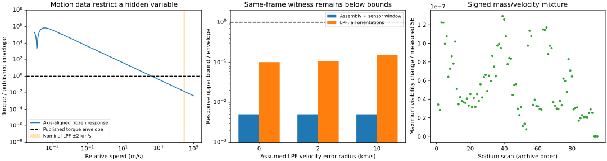

# Moving-field joint dephasing compatibility

**Result:** motion removes the vanishing point-frequency response of the old stationary construction. Recomputing the benchmark in the same frame still gives a sufficient joint envelope survivor under the explicit assumptions below. This is ensemble dephasing, not outcome selection.

For a 100 nm silica sphere, 100 nm transverse separation and 10 ms duration, the SSB-frame witness has tau=1e+06 s, lambda=35.6535 /s, and lambda/tau=3.56535e-05 /s². Its exponent is 10 by construction. Motion increases the required lambda/tau by 7.72e+08 relative to the stationary benchmark.

| Constraint / comparison | Result |
|---|---|
| Complete sensor assembly, all cross terms bounded, Blackman window stress | <= 0.0049991 of the quoted force envelope |
| LPF half-differential torque, any orientation/cross correlation, nominal velocity minus 2 km/s | <= 0.10785 of the published envelope |
| Sodium signed mass/velocity mixture, orientation outer bound | visibility changes <= 1.2922e-07 measured standard errors |
| Force alone: sufficient allowed a | <= 0.007132 /s² |
| Space alone: sufficient allowed a | <= 0.00033058 /s² |
| Joint: sufficient allowed a | <= 0.00033058 /s² |
| Sodium one-SE response scale (not a confidence limit) | 284.08 /s² |

The response upper bounds certify a sufficient allowed region; their failure does not certify exclusion. Dataset removal is given by the single-channel columns. No joint 95% interpretation is assigned to the published envelopes or to the sodium distinguishability diagnostic.

## What the auxiliary records change

JPL vectors give nominal LPF speeds 29647.96–29867.93 m/s in the SSB frame and 315.70–443.39 m/s relative to Earth over the padded February 2017 run. The LPF source explicitly labels this a prediction after April 2016; 0, 2 and 10 km/s error radii are sensitivity assumptions, not tracking uncertainties.

The sodium mass spectrum, optical powers and author velocity distribution control the nonlinear harmonic calculation. Suppressing advection in the finite-time prescribed-path diagnostic gives large dephasing; the moving calculation leaves it essentially unchanged. The archive supplies a velocity model, not event-resolved velocities. Removing its width and varying it through the paper's 5–7% range is saved in the JSON.

A frozen field can correlate two spatially separated masses at a time lag equal to their separation divided by speed. Equal-time separation is therefore insufficient to assume independent colored force spectra. The implemented torque upper bound includes the worst allowed pair correlation; the JSON also records a constructive delayed-correlation zero.

## Finite observation and geometry

The sensor paper specifies 100 kHz sampling, 2^22-sample Blackman blocks and 40–80 averages. The code evaluates mechanical-pole/window convolution at retained bins, exact constant leakage for both Blackman conventions, and Qprime sensitivity. For moving channels, a PSD bound uniform in frequency survives every nonnegative normalized spectral window. Transfer calibration remains a premise: this does not reconstruct missing filtered time streams.

The sensor bound adds the layered load, Si flexure, magnet and an epoxy mass bound at the spectral-amplitude level, retaining every cross term. It assumes a vertical mode between zero and one when normalized at the load; a factor-ten response stress and the maximum gain allowed by the data are documented in the derivation. The LPF bound is uniform over cube orientation and relative-mass phase, so missing attitude cannot invalidate it within the rigid-source model.

## Quantifiers and remaining empirical limit

One common SSB field supplies the benchmark and every response. A separate Earth-corotating model is calculated and explicitly marked non-inertial; no instrument is assigned its own optimizing frame. The 13 inertial frame samples are a sensitivity profile, not an exclusion over all velocities. No high-speed or large-tau cutoff is used to manufacture exclusion.

The constructive frozen spectral atom and finite-OU witness are response-level survivors. The sodium result is conditional on the local advected Markov/paraxial map and measures change from the audited optical baseline, whose existing residuals remain. It is not a newly calibrated goodness-of-fit acceptance. The LPF envelope remains a published summary, with no reconstructed attitude/control-subtraction likelihood. Thus the implemented creative combination is substantive but does not yet meet the stronger standard of a fully calibrated empirical joint survivor.

See [physical derivation and acquisition audit](../moving-frame.md) and [machine-readable comparisons](motion.json).
