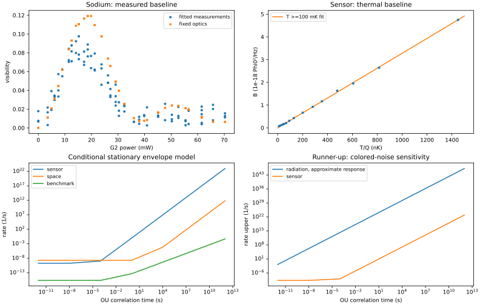

# Collapse compatibility: audited baselines and conditional spectral feasibility

No new physical exclusion is established. The completed result is a reproducible comparison of two dataset combinations and a constructive long-memory escape for stationary-response spectral envelopes. Applying that escape to a universal colored-collapse field still requires moving-apparatus, noise-frame and finite-window response models.

## Observed-source reproduction

- Sodium: 95 scans, 3895 count bins; interpolated mean mass 171283.8 u. Independent linear versus author nonlinear visibility fits differ by at most 2.81e-05. The RMS fixed-optics visibility residual is 0.02086.
- Deposited macroscopicity posterior convention: tau_e 5% quantile 2.84207e+15 s, log10(tau_e)=15.453634. This fixes empirical phase, source rate and calibration; it is not a new confidence limit.
- Sensor workbook: reproduced force estimate -1.5092e-36 N²/Hz and quoted 95% upper 2.07346e-36 N²/Hz.
- Independent B-error-only temperature regression differs from the published orthogonal-fit intercept by 0.230 published standard errors. Missing T/Q covariance prevents exact orthogonal-fit replay.
- All 14 spectra are fitted with explicit six-bin masks and assumed Qprime. Largest absolute B discrepancy is 8.70%. These are conditional reproductions, not exact replicas.
- Workbook audit: M26 sums error contributions; N23 uses stiffness uncertainty in a derivative that calls for stiffness. The independent-quadrature recalculation is a sensitivity check, not a replacement confidence bound. The paper supplement's reported uncertainty also differs from its main text and workbook.
- XENONnT 2022 subset: 433 events; no-background-subtraction Poisson signal-count upper 468.826. The newer 1–140 keV collapse analysis is not reproduced by this 1–30 keV release.

## Selected combination: kHz layer sensor + mHz space envelope

At rc=100 nm, for a static 100 nm silica sphere separated by 100 nm, 10 ms duration and required coherence factor exp(-10):

| OU correlation time | Required rate /s | Sensor alone upper /s | Space alone upper /s | Joint upper /s | Compatible |
|---|---:|---:|---:|---:|---|
| 0 s | 2.31e-16 | 1.9e-10 | 1.92e-09 | 1.9e-10 | True |
| 1e-12 s | 2.31e-16 | 1.9e-10 | 1.92e-09 | 1.9e-10 | True |
| 1e-08 s | 2.31e-16 | 1.9e-10 | 1.92e-09 | 1.9e-10 | True |
| 0.0001 s | 2.33e-16 | 1.13e-09 | 1.92e-09 | 1.13e-09 | True |
| 1 s | 4.64e-14 | 0.0938 | 1.92e-09 | 1.92e-09 | True |
| 1e+04 s | 4.62e-10 | 9.38e+06 | 6.82e-05 | 6.82e-05 | True |
| 1e+08 s | 4.62e-06 | 9.38e+14 | 6.82e+03 | 6.82e+03 | True |
| 1e+12 s | 0.0462 | 9.38e+22 | 6.82e+11 | 6.82e+11 | True |

At white noise the sensor dominates. At tau=1 s the space envelope improves on the sensor alone by 4.88e+07, but still permits the declared benchmark. Removing either dataset recovers the corresponding single-source column. This is complementary physics, not increased event statistics.

All selected benchmark/grid combinations remain compatible, including half/double envelope stress factors. These stress factors are not calibrated uncertainty coverage. Layer-thickness sensitivity is retained in compatibility.json.

The selected values are deterministic comparisons against quoted envelopes. They have no asserted joint 95% coverage, use an isolated sensor load, and assume stationary-body spectral factorization. The common noise rest frame is not fixed by the records.

## Runner-up: sensor + radiation

At white noise and rc=100 nm the approximate 1–30 keV radiation recast gives rate uppers 1.28e-16–1.33e-16 /s across the published atomic-distance range. The detector efficiency and charge cancellation are included; resolution/migration is not. This is a feasibility result, not a certified benchmark exclusion.

The runner-up JSON retains radiation alone, sensor alone and their minimum at every correlation time. Radiation loses leverage rapidly when the spectrum suppresses photon frequencies; the white bound is never copied into a colored analysis. Efficiency and atomic-distance sensitivity are explicit.

## Conditional limitation and scope

Choosing lambda(tau)=C/[G H(T,tau)] keeps stationary macroscopic suppression at C. Every finite positive-frequency response tends to zero as tau grows; the covariance amplitude lambda/(2tau) stays finite. Saved witnesses meet the benchmark exactly. The exact affine certificate checker separately rejects missing tails and failed between-grid domination.

This is not a demonstrated universal-model escape. Moving through spatially correlated noise shifts the sampled frequencies; the local sodium diagnostic differs by nearly three orders of magnitude from a stationary holding-time approximation at a 1 microsecond memory time. Actual instrument leakage may also measure nominally unobserved frequencies.

## Novelty, validation and next input

The broad strategy, mechanical spectral robustness, and force/torque noise ratios have substantial prior art. No breakthrough or novel physical theorem is claimed. This PR contributes reproducible audits, executable candidate comparison, and explicit reasons the ambitious exclusion is not yet enabled.

Validation includes independent time/Fourier geometry calculations, the inspected author-module oracle, synthetic count/PSD injection tests, simultaneous-bound calibration, deliberate spectral gaps and invalid-tail certificates. Offline checks recompute conditional outputs and regenerate this report; full-source checks additionally reread hash-pinned originals.

The highest-value next input is a validated colored response for the moving apparatus in a declared noise frame, with calibrated finite-time detection kernels. A slowly held massive superposition at several durations would directly address the remaining zero-frequency response.

See [derivation](../derivation.md), [candidate comparison](../combinations.md), [source dictionary](../data-dictionary.md), and [literature audit](../literature.md).

