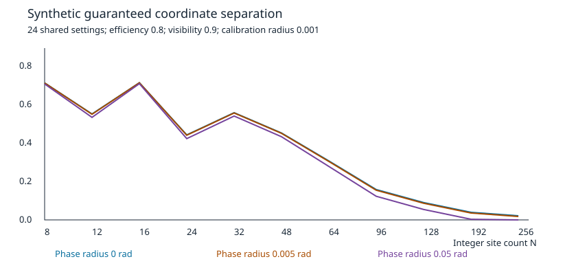

# Continuum dynamics and finite alternatives

**Synthetic prospective study; draft formal companion; no experimental
exclusion.** A finite spectral model reproduces restricted continuum experiments
exactly. A specified nearest-neighbor spatial lattice instead changes relative
mode phases, with a detectable difference only under adequate access and calibration.

The [model](model.md) gives the circle dynamics, spectral counterexample,
approximation/tail derivation, finite-resource quantifiers and exact blind spots.
The executable [decision rule](decision.py) converts complete calibration/main
counts into rejected candidate site counts with coordinate witnesses. The
[shared-nuisance refinement](joint.py) additionally enforces the common scale
and phase across momenta, with six target-gap refinements and [certified sensitivity bounds](results/shared-sensitivity.json).
The [protocol](protocol.md) specifies a common 24-setting experiment, complete
outcomes, nuisance boxes, simultaneous rejection and conditional acquisition cost.
The [literature review](literature.md) assesses primary sources and dataset fit.
No source data are used in the generated [sensitivity map](results/sensitivity.json).



Run from any working directory:

```sh
python /path/to/repository/studies/continuum-finite-models/design.py --check
python /path/to/repository/studies/continuum-finite-models/joint_design.py --check
```

From the repository root, `python -m unittest discover -s tests -v` includes
independent matrix diagonalization/evolution, complete POVM tables, convergence,
stable tiny-tail control, calibration boundaries, strict count-based decisions,
complete failures, joint distributions and sampling
checks. Running `design.py` without `--check` regenerates JSON and SVG. Source
hashes identify the numerical code and its model/protocol assumptions; the Git
commit identifies the complete revision. Floating values compare with declared
tolerances; integer counts and categorical decisions compare exactly.

The map covers 660 synthetic parameter combinations. A zero **certified** gap
is inconclusive unless an overlap construction applies. It is not labeled as
an optimized minimum over jointly shared nuisance parameters. The separate
shared-scale study recovers certified gaps for some of these inconclusive rows.
Calibration and main trials are reported separately. The total eligible
count includes 24 main and 3 calibration strata. Total source attempts remain
unknown because preparation efficiency and physical scale/phase certification
are missing. Prospective unconditional power is at least 87.50%, conditional
on the declared external certificates, at type-I risk at most 5.00%.

## Completion/disposition register

The machine-readable [register](questions.json) records dependencies and next
steps. None of the numerical corroboration is a substitute for a Lean proof.

| ID | Disposition |
|---|---|
| CF01 | Common operational interface and finite objects specified |
| CF02 | Infinite spectral evolution and full chain compiled and audited |
| CF03 | DFT, normalization, small sizes and aliasing checked numerically; formal spectrum and aliasing compiled; combined formal checks passed |
| CF04 | Spectral finite counterexample checked with complete POVMs; formal finite embedding compiled |
| CF05 | Global 1/24 approximation, normalized tail and Born bounds implemented formally |
| CF06 | Joint-product TV and finite-resource limit/test-error composition implemented formally |
| CF07 | Implementable ideal readout, wrapping and negative controls checked; apparatus calibration missing |
| CF08 | Single-mode scale overlap and multi-mode shared-scale exclusion checked |
| CF09 | Executable count-based decision and conditional eligible budgets complete; source and physical calibration cost blocked |
| CF10 | Scoped primary-source comparison completed; unavailable version details not used |
| CF11 | No inspected compatible dataset; prospective outcome selected |
| CF12 | Literal path occupancy outside scope; no conclusion relies on it |

Merge readiness requires the companion formal proofs, audit and report to be
complete and linked to an immutable verified commit, plus all final-head CI gates. This study does not narrow that requirement by
calling the current numerical result a continuum theorem.


Formal evidence is in [draft #91](https://github.com/stevenwarejones/ontology-separation/pull/91).
The [formal source and regenerated evidence at a8d6867](https://github.com/stevenwarejones/ontology-separation/tree/a8d68678e85d12fe1204390e67daa0d750ccfe98)
is immutable and includes the global dispersion, normalized tail, Born, product-TV,
strong-convergence and explicit witness chain. Its Lean sources passed the full
`scripts/check.sh` at `4864f79`; the linked commit adds the exact regenerated audit
and theorem report. This is an immutable draft-branch commit, not a merged-main
commit. The final-head snapshot consistency gate remains a merge requirement.
Both studies remain drafts until the complete formal result and final artifacts
are verified; merged-main links can be pinned after that review.
