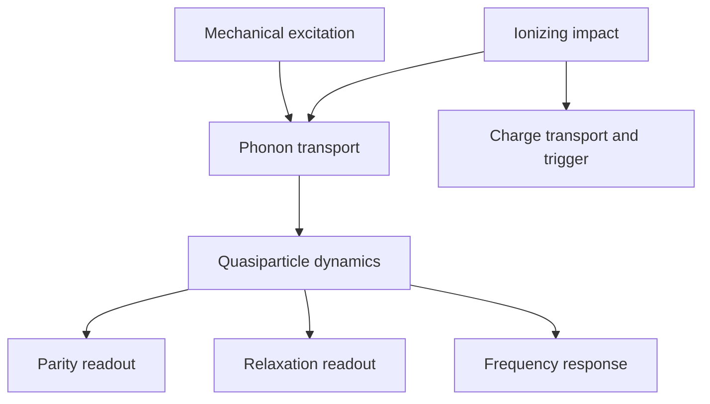

# Physical bridge and observation limits

## Separate the source, chip and readout

Readout filtering and event selection act after each of the final nodes and on
the charge trigger. Charge acceptance depends on impact position and energy;
conditioning on a detected charge jump changes the population of events.
Mechanical/TLS and microwave/readout paths can also affect the outputs without
following the QP branch. The diagram is a candidate mechanism, not an asserted
complete causal graph.

For chip d, let u_d(E,r,t) be its injected phonon source, K_d its transport and
pair-breaking operator, and g_dq(t) the resulting generation rate of normalized
QP density at qubit q. A common low-density model is

\[
 g_{dq}=K_{dq}[u_d],\quad
 \dot x_{dq}=g_{dq}-s_{dq}x_{dq}-r_{dq}x_{dq}^{2},
 \quad x_{dq}\ge0.
\]

Here x is dimensionless, while g, s and r have units s⁻¹. K contains geometry,
energy thresholds, interfaces and conversion to density. Nonnegative generation,
trapping and recombination preserve x≥0. An energy-resolved treatment may be
necessary; one scalar density need not determine both relaxation and tunneling.

Under their respective low-energy/distribution assumptions, response laws take
forms such as ΔΓ1=κ1 x and δf=κf x. Tunneling generally involves a functional of
the QP energy distribution and junction gaps. Treating κp/κ1 as a universal
constant would silently insert the very cross-experiment calibration at issue.
The integrated tunneling intensity Λ=∫Γ_tunnel(t)dt is dimensionless. It is not
simply a fitted instantaneous density without a residence-time/readout model.

| Proposed sharing | Status in this gate |
|---|---|
| Positive source/transport; pair-breaking energy threshold; QP rate equations | Common physical structure, conditional on the model's approximations |
| Silicon material constants and measured film geometry | Can inform K; require uncertainty and actual device matching |
| Boundary escape and qubit trapping coefficients | Device-specific fitted quantities in Yelton; not shared here |
| Gamma dose variation within one device | Measured intervention coordinate, with stationary response still to validate |
| Charge acceptance, HMM detection, coincidence dead time and mapping fidelity | Protocol-specific nuisance parameters; not universal |
| Mechanical acceleration → GHz phonon generation at the qubit | No calibrated map established in the inspected records |
| Injection → gamma event-conditioned Λ distribution | Not established; source spectra, impact locations and geometry differ |

Even in a linear response model, calibration of K on one injected spectrum
constrains K[u_cal], not K[u_target] for an arbitrary different spectrum or
position. If nonnegative K1 and K2 agree on all calibration inputs but differ on
a target input, the target is not identified in that operator class. A complete
physical simulator or measured spanning calibration can remove this freedom;
we have not proved that every physically admissible transport model retains it.
This is why the cross-chip stopping decision is not an impossibility theorem.

## What parity measures

Assume, explicitly, that conditional on a nonnegative random intensity Λ, the
number of tunnel events N is Poisson. The distribution of Λ allows heterogeneous
impact positions, energies and recovery profiles. Assume the measured net parity
faithfully reports whether N is odd, and independent background parity can be
corrected. Then

\[
 p_{odd}=\frac{1-\mathbb E[e^{-2\Lambda}]}2,\quad
 c=2p_{odd},\quad A=\Pr(N\ge1)=1-\mathbb E[e^{-\Lambda}].
\]

For an independent background odd probability b<1/2, XOR composition gives
p_obs=b+(1−2b)p_odd, hence c=(2p_obs−2b)/(1−2b). This does not correct arbitrary
filtering, background-trigger correlation or readout errors. Those must be
calibrated separately. Statistical noise can produce unphysical point estimates;
truncating them is not a confidence procedure.

Larson's Eq. (1), as read in arXiv:2503.07354v1, estimates this corrected contrast
under a randomized-parity burst interpretation. In that interpretation a poisoned
burst produces an odd result with probability 1/2. Calling the result a
"poisoning probability" is appropriate to that operational burst model. It is
not automatically the probability of at least one tunneling event under every
possible intensity distribution.

## Sharp model-conditional interval

Put X=e^(−Λ)∈[0,1]. Then E[X²]=1−c. Since X²≤X and by Cauchy–Schwarz,

\[
 1-c\le\mathbb E[X]\le\sqrt{1-c},\qquad
 \boxed{1-\sqrt{1-c}\le A\le c.}
\]

The lower endpoint is attained by constant Λ=−log(1−c)/2 for c<1. The upper
endpoint is a supremum for unrestricted finite intensities: mix Λ=0 and Λ=L
with probability w=c/(1−e^(−2L)) on L and let L grow. This gives exactly the
same contrast and A=c/(1+e^(−L)). At c=1 the displayed singleton is only a
limiting result; no finite almost-sure Λ gives exactly c=1. Rounded measured
contrast 1.00 must not be treated as an exact finite-intensity statement.

If a genuinely calibrated cap Λ≤L exists, feasibility requires
c≤1−e^(−2L), and the sharper upper endpoint is

\[
 A\le\frac{c}{1+e^{-L}}.
\]

Proof: for a=e^(−L), (X−a)(X−1)≤0 implies
X≥(X²+a)/(1+a). The two-point mixture at 0,L attains the bound. Conversely,
if every active event has Λ≥L_min, allowing mass at zero, then
A≥c/(1+e^(−L_min)). Thus L_min≥log(20) is sufficient for c/A≤1.05.
It is an experimentally testable saturation requirement, not a consequence of
the parity trace alone.

Without the conditional-Poisson assumption, a parity observation permits the much
wider interval c/2≤Pr(N≥1)≤1: distributions on {0,1} and {1,2} attain its endpoints.
That elementary counterexample prevents extending the sharper interval to all
possible microscopic models. None of these scalar witnesses is a full-source
witness satisfying all measured coincidence and spectral constraints.

The fitted map 1−exp(−x/x_bar) in Larson's Appendix C.5 can absorb a constant
factor into the freely fitted x_bar. The parity identity therefore **does not
by itself invalidate the paper's plotted phenomenological fit**. It limits the
physical meaning and transferability assigned to that fitted parameter. Whether
heterogeneous intensity laws change its out-of-sample predictions remains open.

## Global rate consistency, not statistical rejection

For measured table rows (z_i,y_i,e_i), suppose some affine curve f_i=a+bz_i obeys
|y_i−f_i|≤k e_i+δ. Any rational weights with Σw_i=Σw_i z_i=0 imply

\[
 \delta\ge \max\left(0,
 \frac{|\sum w_i y_i|-k\sum |w_i|e_i}{\sum |w_i|}\right).
\]

For three rows choose w=(z_j−z_l,z_l−z_i,z_i−z_j); repeated doses admit (1,−1).
The implementation uses the original decimal strings as exact rational numbers,
records the maximizing coefficients, and separately finds a nonnegative affine
curve attaining the bound up to the reported numerical tolerance. The lower
bound is valid even without positivity restrictions. Thus it rules out **every**
affine curve in the stated deterministic envelope. It says nothing about a
nonlinear curve or whether the quoted errors cover the true means.

The four-error envelope is a fixed exploratory diagnostic, not four standard
deviations. The same rule applies to all curves. No joint or source-removed
statistical confidence regions are claimed. Choosing a larger discrepancy after
looking at the data and calling the resulting region 95% would be invalid.
