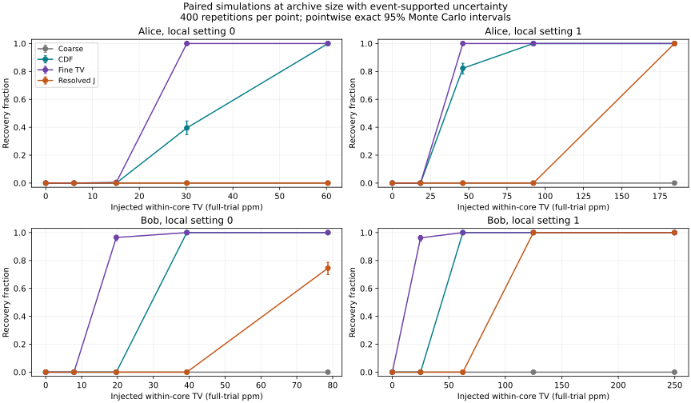

# Paired recovery and assumption stress tests

400 repetitions per case; seed 20260927. Exact pointwise 95% binomial intervals are in recovery-results.json.
Worst-case Monte Carlo SE is 2.5 percentage points. Zero/400 has a 95% upper
limit of about 0.92%; it is not proof of the analytic 1% family guarantee.

The empirical background pools remote labels within 16 chronological blocks
and local settings. Events are sampled independently within blocks. Drift is
retained only through block rates/shapes; arbitrary temporal memory is NOT
recreated. Trusted sample size and fixed uncertain-event candidate budgets
match the archive (scaled with N). The no-missing control uses the same trusted
counts but removes the completion penalty; it does not add missing events.
The remaining N minus trusted rows are no-selected-event padding in this model;
truth values use trusted block sizes divided by full N. Fixed completion budgets
are conservative sensitivity penalties, not a fitted physical missingness law.
Truth values describe the specified pooled law, not an estimated real effect.

Every resolution sees the identical simulated realization. Within-core moves
preserve coarse mass exactly. Translation shifts phase cells within each pulse
and saturates at 161; event-rate changes preserve conditional timing shape.
The mass that would cross that upper boundary is recorded per translation case.

## Sparse archive-size within-core redistributions

Event-supported completion, original N. Counts are recoveries /400; J is
positive resolved TV gain beyond coarse. All sizes, amplitudes and resolutions
are retained in the machine-readable result.

| Receiver/y | Moved core fraction | True fine TV (ppm) | Coarse | CDF | width8 | width2 | width1 | Positive J width1 |
|---|---:|---:|---:|---:|---:|---:|---:|---:|
| alice/0 | 0.0 | 0.0 | 0 | 0 | 0 | 0 | 0 | 0 |
| alice/0 | 0.1 | 6.0 | 0 | 0 | 0 | 0 | 0 | 0 |
| alice/0 | 0.25 | 15.1 | 0 | 0 | 0 | 0 | 2 | 0 |
| alice/0 | 0.5 | 30.2 | 0 | 158 | 0 | 0 | 400 | 0 |
| alice/0 | 1.0 | 60.3 | 0 | 400 | 0 | 0 | 400 | 0 |
| alice/1 | 0.0 | 0.0 | 0 | 0 | 0 | 0 | 0 | 0 |
| alice/1 | 0.1 | 18.5 | 0 | 0 | 0 | 0 | 0 | 0 |
| alice/1 | 0.25 | 46.1 | 0 | 329 | 0 | 0 | 400 | 0 |
| alice/1 | 0.5 | 92.3 | 0 | 400 | 0 | 0 | 400 | 0 |
| alice/1 | 1.0 | 184.5 | 0 | 400 | 0 | 0 | 400 | 400 |
| bob/0 | 0.0 | 0.0 | 0 | 0 | 0 | 0 | 0 | 0 |
| bob/0 | 0.1 | 7.9 | 0 | 0 | 0 | 0 | 0 | 0 |
| bob/0 | 0.25 | 19.7 | 0 | 0 | 0 | 386 | 386 | 0 |
| bob/0 | 0.5 | 39.3 | 0 | 400 | 0 | 400 | 400 | 0 |
| bob/0 | 1.0 | 78.7 | 0 | 400 | 0 | 400 | 400 | 298 |
| bob/1 | 0.0 | 0.0 | 0 | 0 | 0 | 0 | 0 | 0 |
| bob/1 | 0.1 | 25.0 | 0 | 0 | 0 | 385 | 385 | 0 |
| bob/1 | 0.25 | 62.4 | 0 | 400 | 0 | 400 | 400 | 0 |
| bob/1 | 0.5 | 124.9 | 0 | 400 | 0 | 400 | 400 | 400 |
| bob/1 | 1.0 | 249.8 | 0 | 400 | 0 | 400 | 400 | 400 |

## Explicit row-model controls

N=200,000, event probability .02, random local setting; previous remote bit
selects one of the two core cells. This is a denser control, not archive power.
Fresh assignments are independent of history. Persistent assignments stay
with probability .9; their joint per-history propensity needs epsilon=.2.
Misalignment deliberately substitutes the previous causal bit as current.
Selective missingness removes events whose current and previous bits match;
completion budgets restore a valid enclosure without predictable missingness.

| Model | Epsilon | CDF /400 | Coarse /400 | width1 /400 |
|---|---:|---:|---:|---:|
| fresh_memory | 0.0 | 0 | 0 | 0 |
| persistent_memory | 0.0 | 400 | 0 | 400 |
| persistent_memory | 0.2 | 0 | 0 | 0 |
| misalignment | 0.0 | 400 | 0 | 400 |
| selective_missing | 0.0 | 0 | 0 | 0 |
| selective_missing_wrongly_ignored | 0.0 | 400 | 0 | 400 |

Rejecting after misalignment, ignoring selective missingness, or falsely
assuming fresh bits is an assumption failure, not evidence of unusual physics.
The ideal-quantizer witness remains exactly invisible to every digital method;
it is verified algebraically in tests, not assigned a fictitious power curve.

