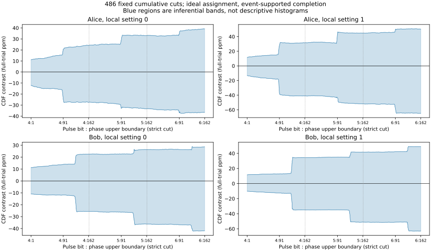
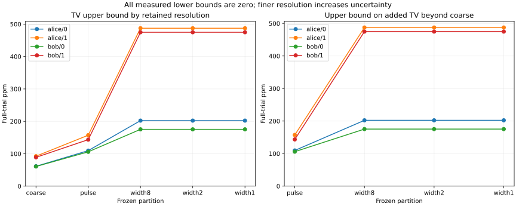

# What finer archived timing buys

**0/24 assumption-specific cases detect a difference; 0 resolve positive information loss J.**
0 confidence/model intersections are incompatible (flagged, not counted as discoveries).
These are overlapping sensitivity cases, not independent replications. A null result is not equality.

Both receivers use the same 107,109,468 interior rows, including no-events.
All source rows reconcile and the fine extraction exactly reproduces the historical
coarse counts, exposures and uncertainty totals. No new experiment or physical calibration.

## Measured comparison

All bounds below are simultaneous full-trial ppm, epsilon=0, event-supported
completion. Other epsilon values (.001,.01) and unrestricted completions are
in results.json. CDF and partition families jointly spend .01 for this extension.

| Receiver/local setting | Representation | Outcome resolution | Effect bound (ppm) | Added information versus coarse |
|---|---|---|---|---|
| alice/0 | Original #13 | 4 outcomes | TV [0.0, 57.7] | Historical reference; original error family |
| alice/0 | Cumulative | 486 fixed thresholds | K_grid [0.0, 39.3] | Pulse and within-category cumulative contrasts |
| alice/0 | Cumulative interpolation | All retained phases | K_full [0.0, 47.9] | Conservative monotone bridge between thresholds |
| alice/0 | coarse | 4 outcomes | TV [0.0, 61.2] | J [0.0, 0.0] |
| alice/0 | pulse | 10 outcomes | TV [0.0, 109.6] | J [0.0, 109.6] |
| alice/0 | width8 | 70 outcomes | TV [0.0, 202.2] | J [0.0, 202.2] |
| alice/0 | width2 | 244 outcomes | TV [0.0, 202.2] | J [0.0, 202.2] |
| alice/0 | width1 | 487 outcomes | TV [0.0, 202.2] | J [0.0, 202.2] |
| alice/0 | Unrestricted retained pair | Pulse + float64 phase | TV_full [0.0, 202.2] | Lower bound from width1; incidence upper bound |
| alice/1 | Original #13 | 4 outcomes | TV [0.0, 85.4] | Historical reference; original error family |
| alice/1 | Cumulative | 486 fixed thresholds | K_grid [0.0, 64.8] | Pulse and within-category cumulative contrasts |
| alice/1 | Cumulative interpolation | All retained phases | K_full [0.0, 91.2] | Conservative monotone bridge between thresholds |
| alice/1 | coarse | 4 outcomes | TV [0.0, 92.4] | J [0.0, 0.0] |
| alice/1 | pulse | 10 outcomes | TV [0.0, 157.2] | J [0.0, 157.2] |
| alice/1 | width8 | 70 outcomes | TV [0.0, 487.4] | J [0.0, 487.4] |
| alice/1 | width2 | 244 outcomes | TV [0.0, 487.4] | J [0.0, 487.4] |
| alice/1 | width1 | 487 outcomes | TV [0.0, 487.4] | J [0.0, 487.4] |
| alice/1 | Unrestricted retained pair | Pulse + float64 phase | TV_full [0.0, 487.4] | Lower bound from width1; incidence upper bound |
| bob/0 | Original #13 | 4 outcomes | TV [0.0, 56.9] | Historical reference; original error family |
| bob/0 | Cumulative | 486 fixed thresholds | K_grid [0.0, 42.2] | Pulse and within-category cumulative contrasts |
| bob/0 | Cumulative interpolation | All retained phases | K_full [0.0, 54.4] | Conservative monotone bridge between thresholds |
| bob/0 | coarse | 4 outcomes | TV [0.0, 60.6] | J [0.0, 0.0] |
| bob/0 | pulse | 10 outcomes | TV [0.0, 105.9] | J [0.0, 105.9] |
| bob/0 | width8 | 70 outcomes | TV [0.0, 175.3] | J [0.0, 175.3] |
| bob/0 | width2 | 250 outcomes | TV [0.0, 175.3] | J [0.0, 175.3] |
| bob/0 | width1 | 487 outcomes | TV [0.0, 175.3] | J [0.0, 175.3] |
| bob/0 | Unrestricted retained pair | Pulse + float64 phase | TV_full [0.0, 175.3] | Lower bound from width1; incidence upper bound |
| bob/1 | Original #13 | 4 outcomes | TV [0.0, 82.2] | Historical reference; original error family |
| bob/1 | Cumulative | 486 fixed thresholds | K_grid [0.0, 63.1] | Pulse and within-category cumulative contrasts |
| bob/1 | Cumulative interpolation | All retained phases | K_full [0.0, 103.8] | Conservative monotone bridge between thresholds |
| bob/1 | coarse | 4 outcomes | TV [0.0, 88.9] | J [0.0, 0.0] |
| bob/1 | pulse | 10 outcomes | TV [0.0, 143.5] | J [0.0, 143.5] |
| bob/1 | width8 | 70 outcomes | TV [0.0, 474.9] | J [0.0, 474.9] |
| bob/1 | width2 | 250 outcomes | TV [0.0, 474.9] | J [0.0, 474.9] |
| bob/1 | width1 | 487 outcomes | TV [0.0, 474.9] | J [0.0, 474.9] |
| bob/1 | Unrestricted retained pair | Pulse + float64 phase | TV_full [0.0, 474.9] | Lower bound from width1; incidence upper bound |

The extension coarse row uses the new family and nested-law constraints; the
historical row uses #13 unchanged. Different confidence bounds are not changes
in the underlying coarse estimand. A refined true TV cannot decrease, while its
estimated upper bound may widen. Tree consistency and the event-incidence cap
prevent adding hundreds of empty-cell penalties into a vacuous TV<=1 result.

## What remains unresolved

A positive J lower bound would show dependence lost by the specified coarse map.
It would not identify its causal origin. Current-intervention interpretations
require the declared per-history joint-setting probabilities and trial correspondence.
The grid preserves pulse identity and one-tag phase cells, but not all decoder
phase digits. K_full interpolation and the full-pair TV cap are conservative
enclosures; they are not full-resolution likelihood fits or analog-delay limits.
All upper bounds apply to time-averaged laws, not instantaneous effects.

See [recovery report](recovery-report.md) for paired empirical-background power,
[conclusions](conclusions.md) for the five research answers, and
[statistics](statistics.md) for coverage, consistency and uncertainty assumptions.

