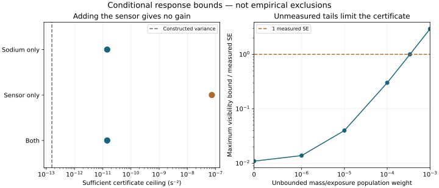

# Moving-noise identifiability: a blocked feasibility result

Can one physically defined field substantially dephase a massive object while
remaining compatible with complementary measured quantum/mechanical responses?

**This follow-up does not achieve the requested complementary empirical endpoint.**
It implements and tests a useful full-quantum perturbation bound and a measured
source-to-response diagnostic, then stops at Gate A because the new bound is
informative only in a band where the sensor adds no identification. It does not
present a narrower response-envelope calculation as mission completion.

Read [the generated result](results/report.md), [model and proofs](theory.md),
[candidate/source audit and exact missing inputs](sources.md), and
[claim-to-prior-art table](prior-art.md).

| Claim | Status |
|---|---|
| Original PR #12 SSB survivor reproduced without modifying that study | Reproduced offline; all eight external source objects verified |
| 95 sodium scans + 14 sensor spectra loaded and baseline/calibration reproduced | Executed full-source route |
| Exact conditional ensemble quantum bound without a local Markov optical approximation | Derived; tested against noncommuting matrix evolution |
| Positive-measure continuum family on 0.1–1 Hz in one Earth-following field law | Constructed with analytic spatial/time lower bound |
| Narrow lines, atoms, sampled windows, motion and delayed covariance checks | Implemented; not a calibrated apparatus injection/recovery |
| Complementary empirical identification or joint confidence | **Not established; source-removal gain is 1** |
| Old SSB witness validated by the new quantum bound | **No; bound is vacuous** |
| Public CAL science images and nine-shot timestamp join | Obtained; physical imaging/lens/motion calibration and 52 pK reproduction remain unestablished |
| Globally optimized arbitrary-spectrum or all-frame result | Not claimed |
| Objective collapse / individual outcomes / publication novelty | Not claimed |

The useful new boundary is concrete. The sodium norm estimate is independent of
unmeasured optical propagation details, but needs bounded exposure/mass tails and
noise-independent preparation. Its one-SE sufficient certificate tolerates at
most about 0.034% unbounded input weight under the stated baseline. That tail
bound is not supplied by an author velocity model. The sensor response can be
small uniformly over the selected spectral band even after conservative fixed
detrending and a tenfold calibration stress, so it contributes no identification
there. LPF and CAL alternatives do not yet supply a joined calibrated response.
The CAL investigation **did obtain public science images**: see the
[shot-level audit and relative-force kernel](cal-response.md). Its nine-shot
image/timestamp join corrects the initial literature-only availability assessment.



## Reproduce

Install [the study requirements](requirements.txt), which include the unchanged
prior study requirements and pin the image decoder.

```sh
python studies/collapse-compatibility/fetch_data.py --data-dir /tmp/noise-sources
python studies/moving-noise-boundary/analyze.py --data-dir /tmp/noise-sources --check
python studies/moving-noise-boundary/analyze.py --check
python studies/moving-noise-boundary/plot.py --check
python studies/moving-noise-boundary/cal_audit.py --check
python studies/moving-noise-boundary/cal_audit.py --data-dir /tmp/cal-sources --fetch --check
python -m unittest discover -s tests -p test_moving_noise_boundary.py -v
python studies/collapse-compatibility/moving_analysis.py --check
```

Original archives stay outside the repository. Full-source checking reopens the
hash-verified measured records; offline checking only reuses the committed small
summaries, recalculates results, and checks provenance. They are not equivalent
claims of source verification. The separate workflow runs both routes when this
study changes, while leaving the existing study workflows intact.

No large parameter campaign, fictional calibrated injection pipeline, modulation
search, or likelihood multiplication was performed after the gate failed.
The route forward is specified in the source audit: better response theory on
existing data, or matched existing-but-unobtained science/calibration records;
new observations are only needed if those cannot close the particular blind band.
