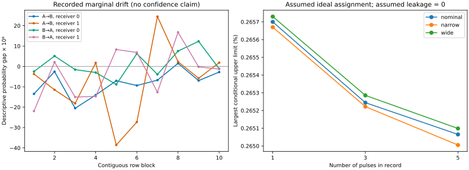

# Recorded marginals and conditional sensitivity

The source contains 107,109,596 aligned stored rows. Both raw setting streams
and the archived click-update behavior reconcile exactly over that interval.
The analysis below uses bitwise-OR reconstructed clicks, includes no-click rows,
and keeps ambiguous settings in the population. No spacelike causal claim is enabled.

## Primary three-pulse record

The marginal differences describe valid-setting rows. The intervals instead use
the full-row score, include worst-case completion of 19,968 uncertain rows,
and require the assignment, record and causal premises in [statistics.md](../statistics.md).
Here joint-setting TV allowance and ordinary-leakage allowance are **assumed zero**.
Bounds are on absolute average signed effects, not average absolute influences.

| Direction | Receiver setting | Descriptive difference (per million) | Conditional absolute upper limit |
|---|---:|---:|---:|
| A → B | 0 | -8.188 | 0.2652% |
| A → B | 1 | -7.450 | 0.2314% |
| B → A | 0 | 1.039 | 0.2546% |
| B → A | 1 | -3.171 | 0.2425% |

The simultaneous interval construction allocates total error 0.01 across the
declared family and every contiguous interval; it tolerates arbitrary device
memory under the stated conditional assignment premise. Every reported interval
contains zero. This does not validate the premise or certify no signaling.

## Assumed calibration sensitivity

Largest primary upper limit across both directions and receiver settings:

| Assumed joint-setting TV | Assumed leakage gap | Conditional upper limit |
|---:|---:|---:|
| 0 | 0 | 0.2652% |
| 0 | 0.001 | 0.3652% |
| 0 | 0.01 | 1.2652% |
| 0.0001 | 0 | 0.3052% |
| 0.0001 | 0.001 | 0.4052% |
| 0.0001 | 0.01 | 1.3052% |
| 0.001 | 0 | 0.6652% |
| 0.001 | 0.001 | 0.7652% |
| 0.001 | 0.01 | 1.6652% |

These allowances are sensitivity parameters, not measured calibration results.
Lack of a valid history-conditional calibration prevents promoting these
numbers to an apparatus-certified causal bound.

## Reconstruction and window sensitivity

| Side | Nominal words corrected | Narrow-radius words changed | Wide-radius words changed |
|---|---:|---:|---:|
| alice | 105 | 5036 | 1093 |
| bob | 94 | 1097 | 337 |

## Selection diagnostic

Conditioning on a sender click yields the following receiver differences.
These are selected correlations, not causal effects; the primary analysis
does not make this selection. Their size illustrates why complete trials matter.

| Direction | Receiver setting | Sender-click-selected difference |
|---|---:|---:|
| A → B | 0 | -0.4561 |
| A → B | 1 | -0.6887 |
| B → A | 0 | -0.4154 |
| B → A | 1 | -0.6620 |

Correcting repeated-index click loss adds the following primary-window
receiver clicks across all setting codes (counts, not inferred effects):

- Alice: 31.
- Bob: 27.

The original diagnostic table is reproduced after assigning the two A=3
no-click rows to A=2. The causal audit does not adopt that ambiguous-setting
assignment. This establishes count reconciliation, not a reproduction of the
published Bell-test p-value or a challenge to that result.

The left panel shows descriptive contrasts for ten contiguous index blocks.
The right panel shows full-run conditional limits under ideal joint assignment
and zero ordinary leakage for all pulse groups and phase radii. Narrow/wide
change each phase radius by one timetagger bin (78.125 ps), keeping its center
fixed. Pulse grouping is distinct from phase-radius variation. Neither is a
new spacelike-separation calibration. No best window is selected.
