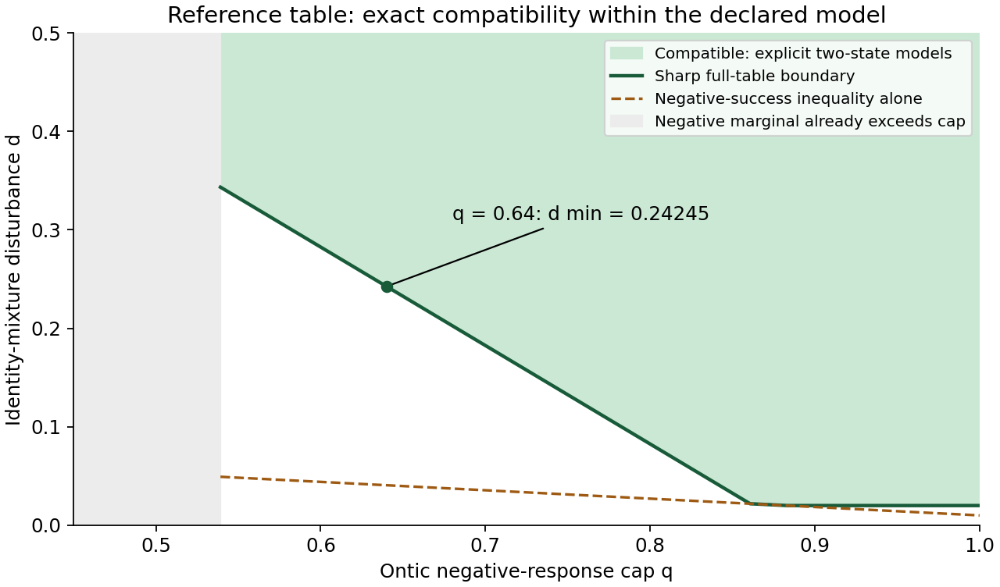
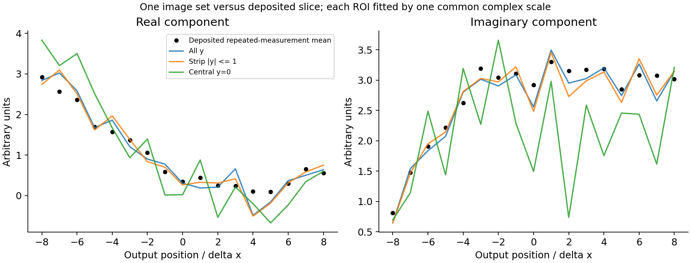

# Sharp compatibility and the measurement needed to resolve an ambiguity

This study separates observations from assumptions through three concrete results:

1. **An exact complete-table compatibility boundary** for the path-contextuality
   reference instrument, with a two-state model at every compatible point.
2. **An auditable reconstruction of the single deposited Wen example**, retaining
   gains, backgrounds, spatial averaging, normalization and reference phase as
   explicit assumptions. It does not reconstruct the unavailable complete experiment.
3. **A finite-menu measurement comparison**, with exact non-identifiability
   certificates and a conditional main-trial budget for a new reference quadrature.

See [derivation](derivation.md), [reconstruction](reconstruction.md),
[measurement design](measurement-design.md), and [evidence and limitations](evidence.md).
The formal companion is [ontology-separation #90](https://github.com/stevenwarejones/ontology-separation/pull/90),
stacked on [#87](https://github.com/stevenwarejones/ontology-separation/pull/87).
Formal compilation and generated audit/report verification are still in progress.

At q=16/25, the minimum disturbance needed for the **complete** reference table is
297/1225≈24.24%, attained exactly. The negative-success inequality alone gives
only the necessary threshold 13/320≈4.06%. These are ontic model-class parameters,
not measured disturbance values or an empirical contextuality claim for Wen.



The Wen equal-gain/zero-background baseline, averaged across y, has a descriptive
10.31% residual after fitting one complex scale to FigS1C. Other declared spatial
reductions give different results. The fit supplies neither missing calibration
nor statistical significance; the images and slice need not be the same repeats.



A calibrated Y reference-quadrature measurement at x=8 distinguishes the declared
nonzero opposite-slope families with a conservative 22 eligible main-trial bound.
That calculation assumes bounded reference offset, visibility and efficiency.
Calibration cost is unavailable and is **not counted as zero**; no end-to-end cost
or current-apparatus feasibility is claimed. If the alternative families overlap,
an exact shared-completion certificate rules out uniform separation by any test.

## Reproduce

```sh
python -m pip install -r studies/path-compatibility/requirements.txt
python studies/path-compatibility/analyze.py --check
python -m unittest discover -s tests -p test_path_compatibility.py
python studies/path-compatibility/plot.py --output-dir /tmp/path-compatibility-figures
```

`results.json` retains exact rational boundary models, all reduced image signals,
conditional coordinate enclosures, and the explicitly assumed design parameters.
Original workbooks remain untouched and are checked against the existing manifest.
