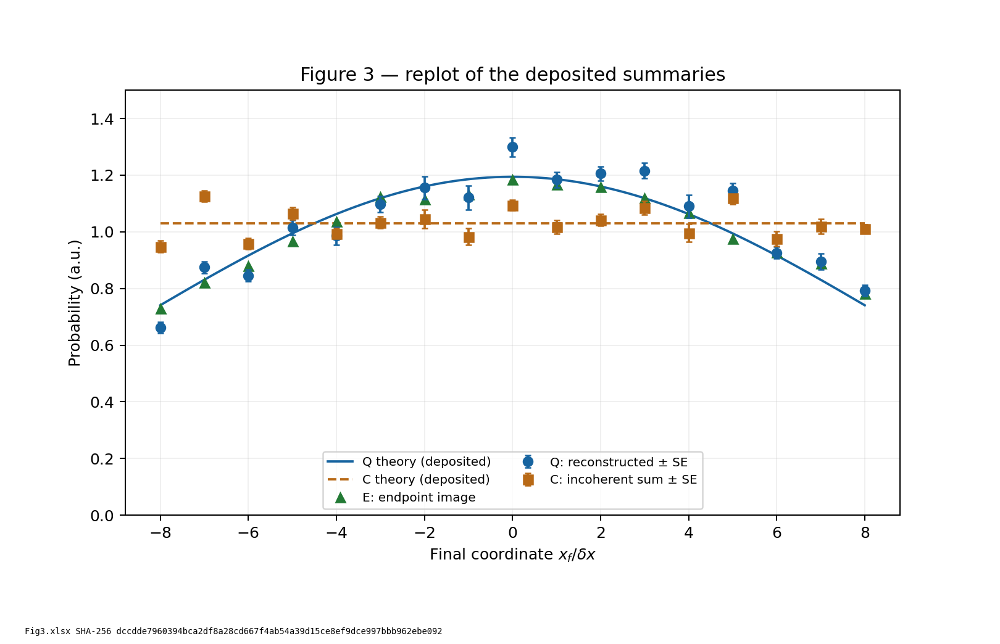
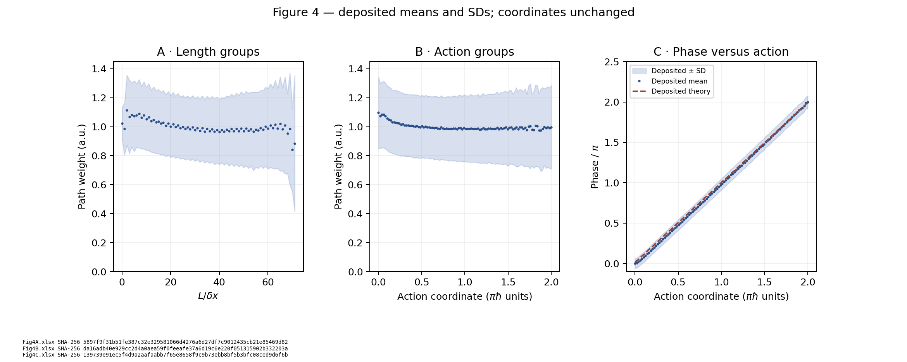

# Wen 2026: propagator and path reconstruction

Independent reproducible checks of Wen et al., *Direct experimental test of
Feynman's path integral postulates with single photons*, Science Advances 12,
eaeh1011 (2026), [paper DOI](https://doi.org/10.1126/sciadv.aeh1011).
This study reproduces the deposited Figure 3/4 summaries and separates observable
comparisons from claims about individual paths. This is not a claim of author error.

## Getting the data

The 19 verified CC0 originals are included unchanged in `raw/dataset/`.
[Download and verification instructions](raw/README.md) identify
[Dryad DOI 10.5061/dryad.x0k6djj14](https://doi.org/10.5061/dryad.x0k6djj14),
version 3 / 450489, the authoritative source. The 19 file digests are fixed by [manifest.json](manifest.json); a mismatch
means the local copy is not verified.
The dataset's own README stays separate from repository instructions.

## Reproduce

From this folder, using Python 3.12:

```sh
python -m pip install -r requirements.txt
python fetch_data.py --verify-only
python extract_workbooks.py
python replicate.py
python synthetic_checks.py --check
```

The extractor writes complete cell inventories to ignored `results/workbooks/`.
Those extracts are not committed or uploaded as CI artifacts. `replicate.py`
reads the verified workbooks directly using [column-map.json](column-map.json)
and writes only derived figures, residual tables and a numerical summary.
Paths resolve relative to the scripts, so invocation from another directory
works. `--directory` chooses another copy of the same originals;
`--output-dir` chooses a separate destination for derived files.

To check reviewed results without replacing them:

```sh
python replicate.py --check
python replicate.py --check --output-dir /tmp/wen-review
```

The second command also regenerates plots for inspection. Snapshot tolerances
describe floating-point reproducibility, not experimental uncertainty. Agreement
with the paper's quoted numbers is not a CI pass condition.

## What has been reproduced





The figures preserve the deposited coordinates, arbitrary units and supplied
SE/SD columns. Figure 3's endpoint acquisition E is descriptively closer to
coherent reconstruction Q than to incoherent sum C: symmetric relative errors
are 4.73% and 12.31%, respectively. That ordering persists after unit-sum
normalization. This is not a significance claim.

The separate Q-versus-theory calculation gives 5.57% using the deposited theory
curve. We read the paper's wording as associating its reported 4.45% with that
comparison; the exact sentence is quoted in [method-comparison.md](method-comparison.md).
Unit-sum E–Q gives 4.49%, a closer but inexact result that keeps the identity of
the evaluated comparison open as a clarification question. Interpolation,
rounding, normalization and alternative common error definitions were checked.
The underlying reference array, processing order and normalization code are
unavailable. These comparisons remain conditional on the stated processing choices.

Figure 4's phase residual RMSE is 0.021815π relative to its deposited theoretical
mean phase. Group means and SDs do not supply the full path amplitudes needed to
recompute the reported 17.40% path-level error or path-space fidelities.

- [Validation and source hashes](results/validation.md)
- [Numerical results and all-sheet inventory summary](results/replication/summary.json)
- [Figure 3 residuals](results/replication/figure3-residuals.csv)
- [Figure 4 phase residuals](results/replication/figure4-phase-residuals.csv)
- [Actual workbook mappings and ambiguities](data-dictionary.md)
- [Why results can differ and whether it matters](method-comparison.md)

## From measurements to path claims

The inference chain has distinct steps:

1. Polarization-resolved camera signals and a reference image are acquired.
2. An optical measurement model maps calibrated signal differences to complex
   propagator estimates K, with reference, normalization and phase assumptions.
3. Products of shared K entries define path amplitudes; coherent sums give Q
   and sums of squared magnitudes give the restricted incoherent comparator C.
4. A separately acquired endpoint distribution E is compared with those predictions.
5. An ontological conclusion requires additional assumptions about which models
   the experiment distinguishes.

The separate E acquisition makes the comparison useful; it is not made vacuous
merely because Q is a reconstruction. Conversely, reconstructed paths are not
independent per-photon trajectory records. The 17⁵ products reuse entries of
five 17×17 propagators. Even those entries can share calibration and source noise.
Resampling path labels cannot replace acquisition-level uncertainty propagation.

For finite matrices the path sum equals the corresponding matrix-product entry:

\[
\sum_{x_1,\ldots,x_{M-1}}\prod_{k=1}^{M}K_k(x_k,x_{k-1})
=(K_M\cdots K_1)_{x_M,x_0}.
\]

The same detector rule therefore predicts the same observations under either
description. Excluding C excludes that defined class, not every theory with
definite trajectories or contextual responses. This paraxial experiment has
ordered propagation slices and does not implement an intervention testing
superluminal or backward-time signaling.

## Uncertainty and remaining inputs

All 19 worksheets were inspected, including the five sample camera images.
There is no complete labelled per-repeat propagator tensor, endpoint repeat
dataset, acquisition ordering or calibration/phase/binning implementation in
these sheets. Processed means cannot reconstruct those records. No p-values or
confidence intervals are inferred from the number of paths or plotted bins.
The supplied Fig4 SDs describe spreads, not errors on independent means.

[Physical correspondence](physical-bridge.md) details preparation, finite-window,
projection, loss and detector obligations. [Open questions](open-questions.md)
records what is closed, what is conditional, and exactly which inputs would
settle the rest. [Literature comparisons](literature-comparison.md) and the
[staged search log](literature-search-log.md) document primary sources, review
depth, adverse checks and review boundaries. Original paper/supplement PDFs remain
outside git; [provenance](provenance.json) records their retrieval identifiers.

The existing synthetic calculations remain separate from empirical replication:
[synthetic results](results/synthetic.json) check finite sums, coordinate
sensitivity and shared-entry noise under stated assumptions. They are neither
a fit to the measured tables nor a reconstruction of the authors' random seed.

## Formal companion and follow-up

The ideal finite case study lives in `ontology-separation`:
[pinned Lean source](https://github.com/stevenwarejones/ontology-separation/blob/ab1eeb81119ff3fdcb46a771d9bcdf5e39ea3d29/OntologySeparation/Experiments/PathInterference.lean)
and [physicist-readable case study](https://github.com/stevenwarejones/ontology-separation/blob/ab1eeb81119ff3fdcb46a771d9bcdf5e39ea3d29/docs/PATH_INTERFERENCE_CASE_STUDY.md).
It certifies finite tables and access-relative model distinctions, not this
apparatus or its empirical numbers.

The [phase-intervention study](../phase-intervention-design/README.md) specifies
a follow-up experiment with complete loss outcomes, calibration requirements and
a conservative conditional power calculation; no experiment has been performed.

## Audit conclusions and reproducibility limits

The [completion report](completion-report.md) maps each audit requirement to its
evidence and every remaining question to its disposition.
[Exact identifiability counterexamples](identifiability_checks.py) explain why the
[missing joint records](required-records.md) cannot generally be recovered from
the deposited marginal summaries. These examples are synthetic and do not change
the reproduced figures or imply an estimate of the missing records.

## Automated checks

[GitHub Actions](../../.github/workflows/ci.yml) verifies the original hashes,
tests integrity failures and mapping/numerical counterexamples, inventories all
workbooks in temporary storage, checks numerical snapshots and residual tables,
and regenerates review figures. It verifies inputs again after processing.
[CI details](results/ci-validation.md) distinguish those software checks from
scientific validation. No workflow updates the data manifest or commits results.
